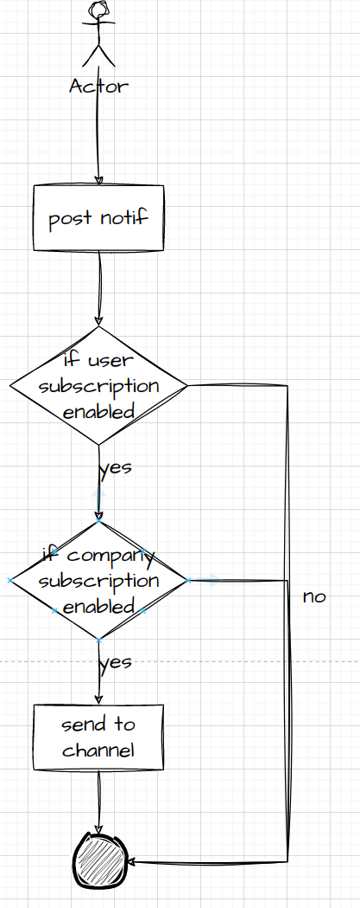
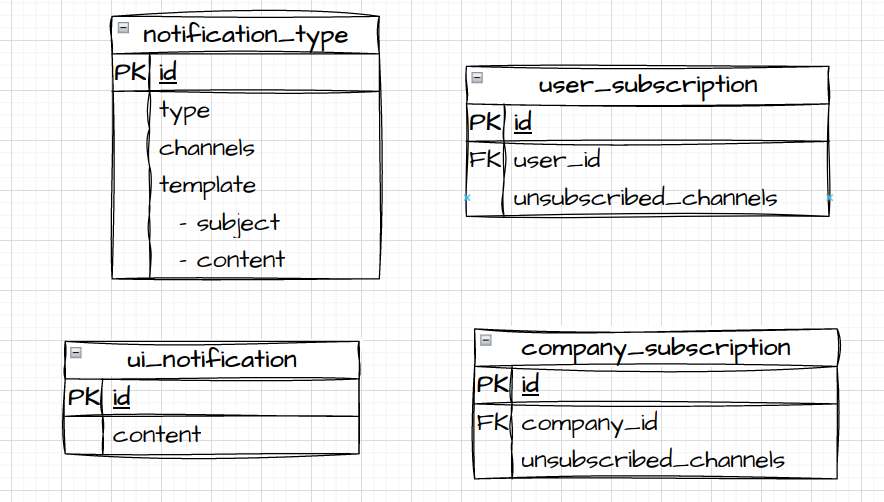

## Description

[Nest](https://github.com/nestjs/nest) framework TypeScript starter repository.

## Installation

```bash
$ yarn install
```

## Prerequisite
1. Docker V2

# How to start

## Run with docker
```bash
docker compose up -d
```

## Using postman to make request
```
Import the file `./notification-svc.postman_collection.json`
```

# Development

## Running app locally 

```bash
# start docker compose for dependencies
$ docker compose up -d mongodb mongo-seed

# development
$ yarn run start

# watch mode
$ yarn run start:dev
```

## Test

```bash
# unit tests
$ yarn run test
```

# App Flow



# Entities

